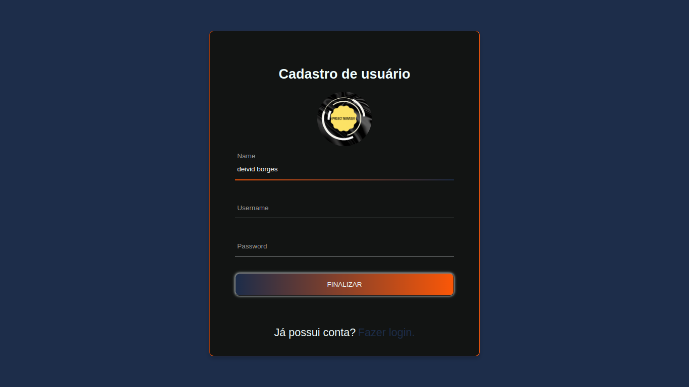
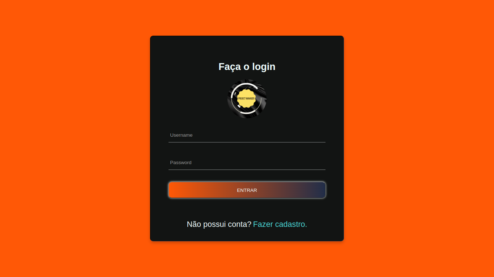
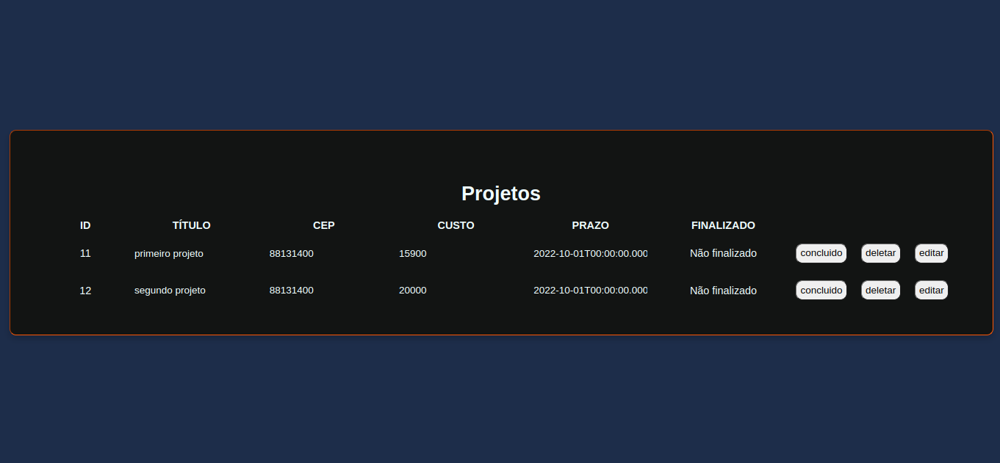
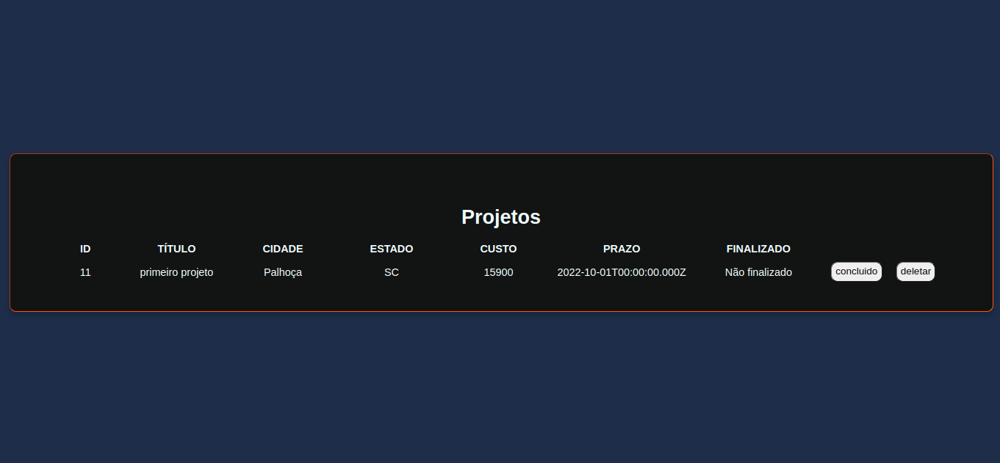
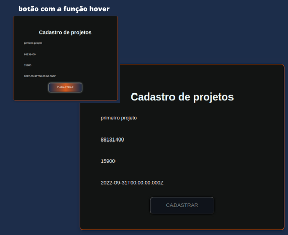

# Boas-vindas ao repositório do projeto CRUD-projects!
 - Uma API para gerenciamentos de projetos.
 - Permite a criação de usuário.
 - E aplica um CRUD de projetos.
 - No frontend uma aplicação que permite criar ususário, login e gerenciar projetos.

## Intuito do projeto
  - Criar uma aplicação que seja possível cadastrar usuários e gerenciar projetos cadastrados
  - Desenvolver um CRUD em node.js
  - Desenvolver frontend em Reactjs
## READMEs

- [README frontend](https://github.com/DeividBorges93/CRUD-projects/blob/master/project-manager-frontend/README.md)
- [README backend](https://github.com/DeividBorges93/CRUD-projects/blob/master/backend/README.md)

# Veja um pouco de como ficou o design da aplicação

## Tela de registro de usuário:
> /register

## Tela de login de usuário:
> /login

## Tela de lista de projetos por usuário:
> /projects

## Tela de projeto por ID:
> /project/:id

## Tela de criação de projeto:
> /project

)
